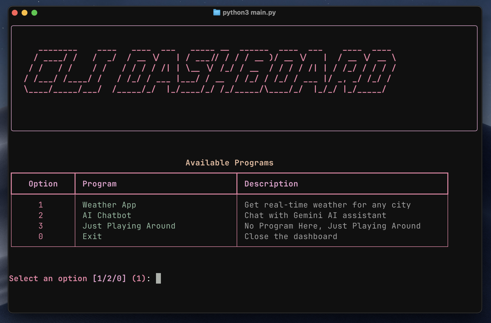
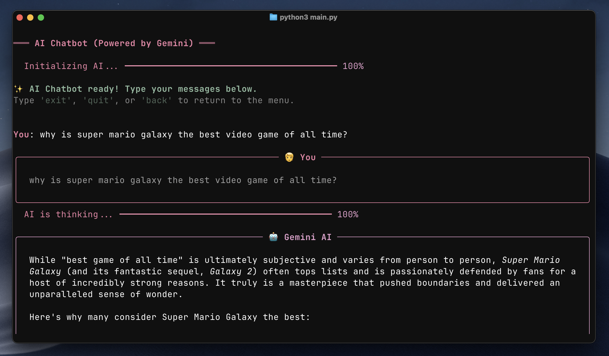

# CLI Dashboard

A flashy terminal dashboard with animated logos, progress bars, and multiple CLI programs.



## Features

- Cool ASCII art logo with colorful styling
- Animated progress bars on startup and transitions
- Interactive menu system
- Weather app with real-time data from OpenWeatherMap (in Fahrenheit)
- AI Chatbot powered by Claude

## Installation

1. Install dependencies:
```bash
pip install -r requirements.txt
```

2. Create a `.env` file in the project root (you can copy `.env.example`):
```bash
cp .env.example .env
```

3. Add your API keys to the `.env` file:
   - Get a free API key from [OpenWeatherMap](https://openweathermap.org/api)
   - Get an API key from [Anthropic](https://console.anthropic.com/) for the AI Chatbot

```
OPENWEATHERMAP_API_KEY=your_openweathermap_key_here
ANTHROPIC_API_KEY=your_anthropic_key_here
```

## Usage

Run the dashboard:
```bash
python main.py
```

## Programs

### Weather App
Get real-time weather information for any city in the world with a beautiful display showing:
- Temperature (Fahrenheit)
- Feels like temperature (Fahrenheit)
- Humidity
- Weather conditions
- Wind speed


### AI Chatbot
Interactive AI assistant powered by Claude that can:
- Answer questions
- Help with problem-solving
- Have natural conversations
- Provide information on various topics



## Adding New Programs

To add a new program to the dashboard:

1. Create a new Python file for your program (e.g., `my_app.py`)
2. Add a function that runs your program
3. Import it in `main.py`
4. Add a menu option in `menu.py`
5. Add the program call in the main loop in `main.py`

## Requirements

- Python 3.7+
- rich
- requests
- pyfiglet
